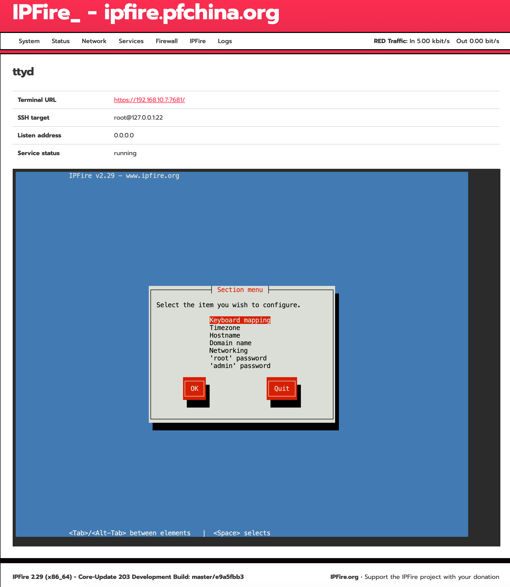

# ttyd for IPFire

[](https://www.ipfire.org/)
[](https://github.com/tsl0922/ttyd)

This project adds ttyd terminal access via the GUI to IPFire.

Tested and verified in the following environments:

- IPFire 2.29 (x86_64) - 203 Development 



## Install

```sh
sh install.sh
```

## Uninstall

```sh
sh uninstall.sh
```
## Disclaimer
This is an unofficial plugin and is not supported by the IPFire team; use at your own risk.
